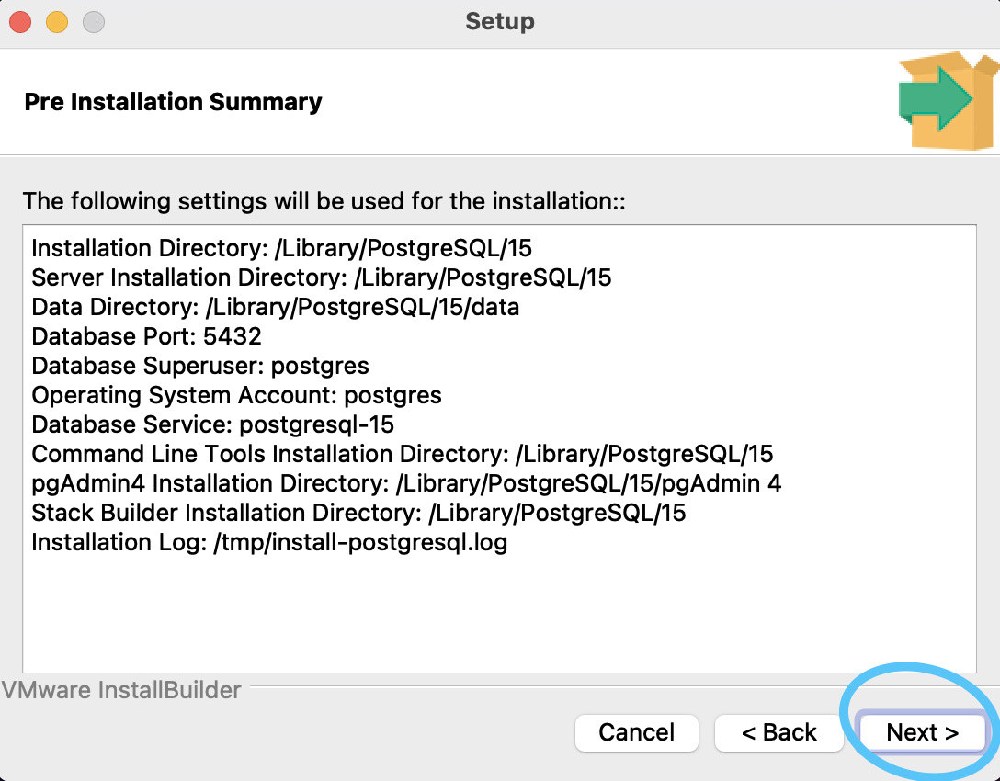
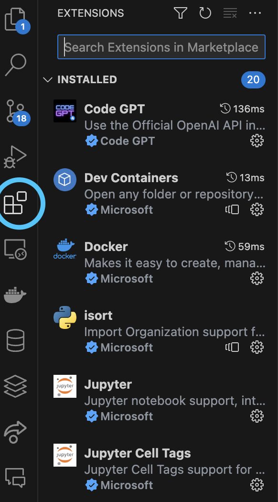

# SQL Eğitim Programı

Bu program aşağıdaki yetkinlikleri kazandırmayı hedeflemektedir:

* İlişkisel veri tabanlarına bağlanma
* Farklı formatlarda bulunan dosyalardan ilişkisel yapılandırılmış veri tabanları oluşturma
* Veri manipülasyonu: farklı veri tiplerini analiz edilebilir hale getirme
* Temel tablo sorgulama yaklaşımları
* İleri seviye tablo sorgulama yaklaşımları
* Veri analitiği sorguları
* Veri analitiği için sanal tablolar oluşturma
* Sanal tabloları bir BI platformuna bağlama ve interaktif dashboard oluşturma

Konular, uygulamalarıyla birlikte senaryolar üzerinden aktarılacaktır. Bu kapsamda, aşağıdaki araçlar kullanılacaktır:

# 1) VSCode

Buradan işletim sistemimize uygun VSCode entegre geliştirme ortamımızı indirebiliriz 👉 [İndirme linki](https://code.visualstudio.com/download)

Varsayılan ayarlarla VSCode yüklememizi yapabiliriz. İlgili yükleme tamamlandıktan sonra VSCode masaüstü uygulamamızı açıp aşağıdaki gibi ana ekran görüntüsünü görebiliyorsak, VSCode kullanımına hazırız demektir 👇🏻

# 2) PostgreSQL

Buradan işletim sistemimize uygun en güncel PostgreSQL veri tabanı yönetimi sisteminizi indirebiliriz 👉 [İndirme linki](https://www.enterprisedb.com/downloads/postgres-postgresql-downloads)

İndirme bittikten sonra kurulumu aşağıdaki adımları uygulayarak gerçekleştirebiliriz 👇🏻

* İndirmiş olduğumuz kurulumu yapacak olan uygulamayı açalım
* Next butonuna tıklayalım
  

* Kurulumun yapılacağı konumu özellikle değiştirmek istemiyorsak "Next" butonuna tıkalyalım

* Eğitim programımız için gerekli olmasa da, ileride bir aplikasyon ya da proje geliştirilmek istedendiğinde yardımcı bileşen uygulamalara ihtiyaç olabilir. Her ihtimale karşı bileşen uygulamaları da indirmek için hepsini seçip "Next" butonuna tıklayalım

* Verilerin depolanacağı konumu özellikle değiştirmek istemiyorsak "Next" butonuna tıklayalım

* En yetkili kullanıcı (Superuser)(postgres) olarak bir şifre belirleyip "Next" butonuna tıklayalım (**Not**: Bu şifreyi unutmamanız oldukça önemlidir.)

* Veri tabanları bir nevi veri alışverişi yapabilen sunucular olduklarından, ağ üzerinden veri tabanlarına bağlantı sağlayabilmek için bir Port numarası belirlemek gerekir. PostgreSQL 5432 Port numarasını dinleyen bir veri tabanı sistemi olduğundan bu numarayı varsayılan olarak bırakıp "Next" butonuna tıklayabiliriz

* Zaman dilimi ve bilgisayarımızın bulunduğu varsayılan bölgeyi belirleyebilmek için bir sonraki sayfada varsayılan ayarda bırakıp "Next" butonuna tıklayabiliriz

* Kurulum özetini inceleyip "Next" butonuna tıklayalım

* Yine "Next" butonuna tıklayara kurulumumuzu başlatalım

* Şimdilik "Stack Builder" uygulamasını açmamız gerekmediğinden tiki kaldırıp "Finish" butonuna tıklayarak, kurulumumuzu tamamlayalım

* Bilgisayarımıza PostgreSQL veri tabanı yönetimi sunucusunu doğru bir şekilde yüklediğimizi test etmek için kurulumla birlikte yüklenen "SQL Shell (psql)" uygulamasını açalım. Bu bir komut istemi/terminal açacaktır.

* Açılan komut istemi/terminal ekranında, Superuser için oluşturduğumuz şifreyi girme kısmı gelene kadar "Enter" tuşuna basalım. Kurulum sırasında belirlediğiniz şifreyi girip "Enter" tuşuna baştıktan sonra aşağıdaki durum ile karşılaşacaksınız

* Kurulumu doğru bir şekilde yapmışız gibi gözüküyor. Tam emin olmak adına bir psql komut istemi/terminal komutu deneyelim. Mevcut ekranda "\l" komutunu yazıp "Enter" tuşlayalım. Aşağıdaki gibi mevcut veri tabanları ve bilgilerini gösteren bir çıktı göreceksiniz.

PostgreSQL veri tabanı sunucusu kurulumumuz hazır. VSCode içerisinde PostreSQL ile ilgili eklentileri yükleme kısmına geçelim.

# 3) VSCode Eklentisi: Database Client

* VSCode masaüstü uygulamamızı açıp, eklentiler bölümüne tıklayalım

* Arama yerine "Database Client" yazıp, ilk eklentiyi indirelim

* İndirdiğimiz eklenti navigasyon barımıza eklenecektir. "Database client" eklentimiz doğru bir şekilde çalışıyor mu test edelim. Öncelikle eklentiye tıkladıktan sonra "Create Connection" butonuna tıklayalım

* PostgreSQL sekmesini seçip, kurulum yaparken "postgres" Superuser için belirlediğimiz şifreyi "Password" alanına girdikten sonra "Connect" butonuna tıklayalım

* Aşağıdaki görseldeki gibi sol üstte "postgres" veri tabanını görebiliyorsak. Eklenti kurulumunu doğru bir şekilde yapıp, bağlantıyı doğru bir şekilde sağlayabilmişiz demektir

# 4) VSCode Eklentisi: SQL Notebook

SQL Notebook eklentisi, içerisine "Markdown" kodu ile birlikte "SQL" sorguları da yazabildiğimiz bir yapı sağlar. Böylelikle sorguların çıktılarını hemen sorgu altında görebilir, "Markdown" kodu yazabilmemiz sayesinde ise çıktılarımızı bir rapora dönüştürebiliriz.

* VSCode masaüstü uygulamamızı açıp, eklentiler bölümüne tıklayalım

* Arama yerine "SQL Notebook" yazıp, ilk eklentiyi indirelim

* Eklentimiz hatasız çalışıyor mu test edelim. Eklentiye gidip, PostgreSQL sunucumuza bağlanalım. İlgili bilgilerimizi girdikten sonra, "Create" butonuna tıklayalım

* "SQL CONNECTIONS" sekmesine tıklayalım

* postgres sekmesine sağ tıklayıp "Connect to Database" butonuna tıklayalım. postgres yazısı yanında "Connected" yazısını görüyorsak bağlantı başarılı bir şekilde sağlanmış demektir.

* Eklentimizin gerektiği gibi çalışıp çalışmadığını test edelim. Explorer sekmesinden yeni bir script dosyası oluşturalım. Dosyamızın ismi "deneme.sql" olsun. Burada "SQL Notebook" eklentisini kullanabilmemiz için script isimlerinin ".sql" uzantısıyla bitmesi önemlidir. 

* Oluşturduğumuz script dosyasına sağ tıkladıktan sonra "Open With..." butonuna tıklayalım

* Çıkan listede "SQL Notebook" seçelim

* İlgili scripte "Markdown" kod bloğu ekleyip, herhangi bir yazı yazalım

* İlgili scripte "SQL" kod bloğu ekleyip, bağlı olduğumuz sunucuyla ilgili bir SQL kodu yazalım

---

Artık eğitime hazırız 🚀

